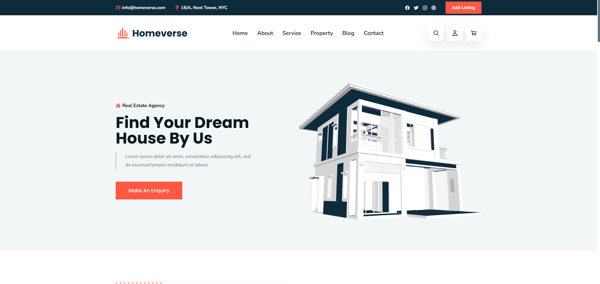

# Homeverse 🏡



Welcome to the Homeverse ! This project is designed to help users find their dream homes by providing a comprehensive listing of properties available for sale or rent.

## Features ✨
- 🏠 Browse listings of properties for sale or rent
- 🔍 View detailed information about each property
- 📞 Contact real estate agents directly through the platform
- ⭐ Add properties to your favorites for easy access

## Tech Stack 🛠️
- **Frontend:** HTML, CSS, JavaScript
- **Assets:** Images, Icons


## Project Structure 📂
```
real-estate-listing-platform/
├── assets/
│   ├── css/
│   ├── images/
│   └── js/
├── readme-images/
├── index.html
├── favicon.svg
└── README.md
```

## 🤝 Contributing

Contributions are welcome! Please feel free to submit a Pull Request.

## 🙏 Thank You

Thank you for checking out **Homeverse**! I hope you enjoy using the platform as much as I enjoyed building it. Your feedback and support mean a lot!

---

